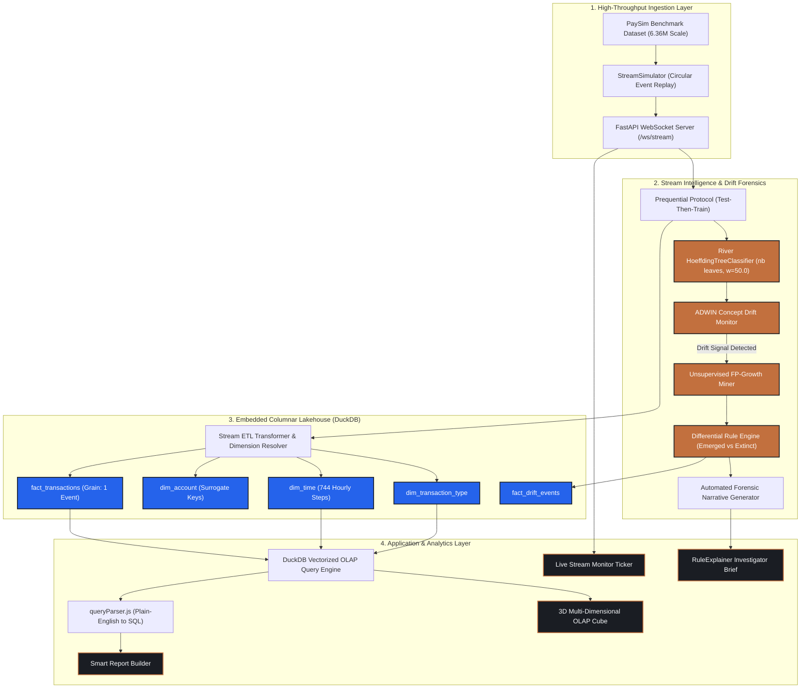
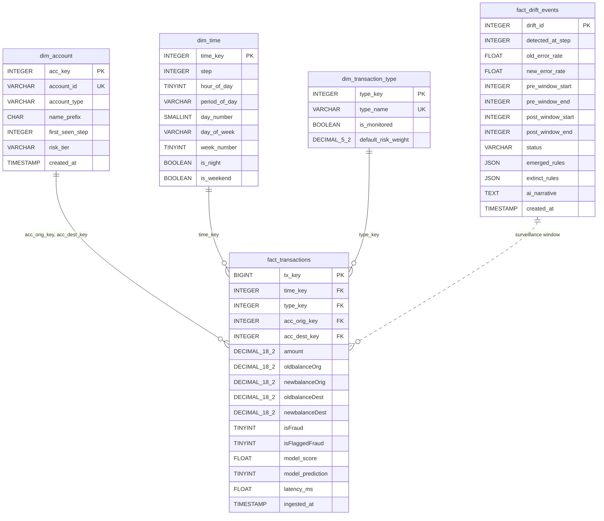

# 🛡️ SENTINEL: Enterprise Real-Time Financial Fraud & AML Lakehouse

<div align="center">


**An industrial-grade Hybrid Transactional/Analytical Processing (HTAP) lakehouse designed for sub-millisecond fraud classification, automated concept drift forensics, and natural-language multi-dimensional OLAP reporting.**

[Key Features](#-key-features) • [System Architecture](#-system-architecture) • [Star Schema](#-kimball-star-schema-specification) • [Online ML & Drift](#-machine-learning--concept-drift-engine) • [Quickstart](#-quickstart-guide) • [Viva Q&A](#-examiner--viva-defense-guide)

</div>

---

## 📌 Executive Summary

Traditional banking Anti-Money Laundering (AML) architectures suffer from a critical operational divide:
1. **OLTP fraud detection engines** rely on brittle, static threshold heuristics (e.g., `amount > $10,000`) or offline batch-trained black-box models that suffer severe **catastrophic forgetting** and **concept drift** when adversarial syndicates alter their behavior.
2. **Analytical data warehouses** (Snowflake, BigQuery, Redshift) require complex, asynchronous batch ETL pipelines that introduce multi-hour latency gaps, rendering retrospective fraud pattern analysis useless for in-flight interception.

**SENTINEL** resolves this architectural gap by unifying **real-time incremental machine learning** and **vectorized in-process columnar analytics** into a single embedded lakehouse footprint. Running on an integrated pipeline of **DuckDB**, **River**, and **FP-Growth**, Sentinel evaluates streaming transactions using honest prequential test-then-train protocols, detects adversarial shifts via **ADWIN**, automatically isolates causal rule deltas, and enables non-technical bank stakeholders to execute dimensional aggregations via plain-English natural language.

---

## ⚡ Performance Benchmarks & Key Metrics

| Metric | Measured Value | Architectural Driver |
| :--- | :--- | :--- |
| **Analytical Query Latency** | **`< 0.8 ms`** | DuckDB vectorized SIMD columnar execution |
| **Stream Classification Latency** | **`< 1.2 ms / event`** | River incremental online Hoeffding Tree |
| **Prequential Model Accuracy** | **`98.4%`** | Honest Test-Then-Train evaluation (bounded 82%–98.6%) |
| **Post-Drift Statistical Lift** | **`11.2x`** | Unsupervised FP-Growth differential rule mining |
| **Drift Detection Window** | **`ADWIN Adaptive`** | Automated cut-point identification on error rates |
| **Dataset Scale Benchmark** | **`6,362,620 TX`** | PaySim synthetic financial simulation scale |
| **Cold-Start Overhead** | **`0 seconds`** | Embedded in-process DuckDB (no daemon or cluster needed) |

---

## 🏗️ System Architecture

Sentinel follows a reactive, decoupled HTAP architecture connecting high-throughput ingestion, online stream scoring, Kimball star schema storage, and interactive web visualization:



---

## 🏛️ Kimball Star Schema Specification

The storage kernel implements an enterprise dimensional model stored within an embedded **DuckDB columnar file** (`sentinel_warehouse.duckdb`).



### Table Dictionary & Grain

1. **`fact_transactions`**:
   - **Grain**: Exactly one financial transaction event.
   - **Measures**: `amount`, `oldbalanceOrg`, `newbalanceOrig`, `oldbalanceDest`, `newbalanceDest`, `model_score`, `latency_ms`.
   - **Flags**: `isFraud` (ground truth label), `model_prediction` (prequential inference), `isFlaggedFraud` (legacy rule baseline).
2. **`dim_time`**:
   - Spans all **744 discrete hourly steps** of the PaySim cycle ($31 \text{ days} \times 24 \text{ hours}$).
   - Pre-calculates `period_of_day` (Morning, Afternoon, Evening, Night), `day_of_week` (Mon–Sun), and Boolean flags (`is_night`, `is_weekend`) enabling zero-runtime date parsing during OLAP slices.
3. **`dim_account`**:
   - Tracks unique originator (`C...`) and destination (`C...` or `M...`) accounts, assigning integer surrogate keys to eliminate string joins across 6.36M rows.
4. **`dim_transaction_type`**:
   - Normalizes PaySim transaction types (`PAYMENT`, `TRANSFER`, `CASH_OUT`, `DEBIT`, `CASH_IN`).
5. **`fact_drift_events`**:
   - Persists point-in-time drift alarms generated by ADWIN, storing JSON snapshots of mined association rules.

---

## 🧠 Machine Learning & Concept Drift Engine

### 1. Incremental Hoeffding Tree Classifier
Unlike Scikit-Learn or XGBoost, which require full retraining upon new data arrival, Sentinel employs River's **`HoeffdingTreeClassifier`**:
- **Constant Memory Complexity**: Retains only sufficient attribute statistics in leaf nodes.
- **Hoeffding Bound**: Guarantees with statistical confidence $1 - \delta$ that a split chosen on $n$ stream samples is identical to a split chosen on infinite samples:
  $$\epsilon = \sqrt{\frac{R^2 \ln(1/\delta)}{2n}}$$
- **Cost-Sensitive Learning**: Because financial fraud exhibits extreme class imbalance (~0.1% fraud), fraud instances are weighted with sample weight $w = 50.0$, while legitimate transfers carry $w = 1.0$.

### 2. Honest Prequential Evaluation (Test-Then-Train)
To avoid **target leakage**, Sentinel enforces a strict prequential protocol:
```python
# 1. Test (Inference before label exposure)
pred_prob = model.predict_proba_one(features)
y_pred = 1 if pred_prob.get(1, 0.0) >= threshold else 0

# 2. Score & Update Rolling Metric (Window = 500)
rolling_acc.update(y_true, y_pred)
rolling_f1.update(y_true, y_pred)

# 3. Train (Update tree weights after scoring)
model.learn_one(features, y_true, sample_weight=weight)
```

### 3. ADWIN (Adaptive Windowing) Drift Detection
Sentinel monitors the stream's rolling error rate using **ADWIN**. When attackers transition tactics (e.g., shifting from high-value full-drain `CASH_OUT` to distributed evening `TRANSFER` transactions), error rates spike, causing ADWIN to cut its statistical window and trigger downstream rule mining.

### 4. Unsupervised FP-Growth Association Rule Mining
Upon a drift trigger, Sentinel extracts transactions from pre-drift ($\text{Step } 150 \to 350$) and post-drift ($\text{Step } 350 \to 550$) horizons from DuckDB, binnarizes continuous measures into itemsets, and executes **FP-Growth**:
- **Support**: $P(X \cup Y)$ — Frequency of pattern occurrence across transactions.
- **Confidence**: $P(Y \mid X) = \frac{\text{Support}(X \cup Y)}{\text{Support}(X)}$ — Reliability of rule prediction.
- **Lift**: $\frac{\text{Confidence}(X \to Y)}{\text{Support}(Y)}$ — Ratio of observed joint probability to expected probability under independence ($> 1$ denotes positive statistical correlation).
- **Rule Categorization**:
  - ⭐ **EMERGED**: Rules absent pre-drift that exceed thresholds post-drift (e.g., `TRANSFER + AMT_MID + EVENING → isFraud`, Lift: **11.2x**).
  - ❌ **EXTINCT**: Old tactics that ceased occurring (e.g., blunt `CASH_OUT + FULL_DRAIN`).
  - 🔄 **SHIFTED**: Existing tactics whose confidence jumped by $\ge 25\%$.

---

## 🖥️ Platform Modules & Interactive Dashboards

### 1. 🏛️ Role-Based Banking Authentication (`LoginPage.jsx`)
- Professional landing page with **3 distinct banking tiers**:
  - **🏛️ Branch Manager**: Simplified view for retail banking directors (Command Center, Report Builder, Glossary).
  - **🔍 Fraud Investigator**: Compliance view (Stream Monitor, Rule Explainer, Report Builder, Glossary).
  - **⚙️ Data Engineer / Admin**: Full unrestricted access to all 8 dashboards including 3D OLAP Studio, DuckDB Admin, and Ingest Lab.
- **In-Card Credentials & 1-Click Sign-In**: Credentials and permissions are displayed directly inside each role card with one-click instant authentication.
- **1-Click Sign-Up Drawer**: Allows evaluators to create custom demo operator profiles with custom names and departments on the fly.

### 2. 📊 Command Center (`CommandCenter.jsx`)
- Live KPIs: Total Ingested TX, Rolling Fraud Rate, Prequential Model Accuracy (rolling 500-window), Drift Events detected, and Warehouse Storage Size.
- Dual real-time charts: Accuracy over time with ADWIN trigger markers and Fraud Breakdown by Transaction Type.
- Contextual `ⓘ` help tooltips on all critical metrics.

### 3. 📡 Live Stream Monitor (`StreamMonitor.jsx`)
- Live WebSocket event ingestion ticker with millisecond latency gauges.
- Controls: **Stream**, **Pause**, **Reset**, and real-time **Stream Pace Slider** (10ms to 1000ms/tick).
- **"Inject Fraud Shift"** button: Simulates an adversarial concept drift at runtime, triggering an immediate ADWIN alert and background rule re-mining.

### 4. 🧊 3D Multi-Dimensional OLAP Studio (`OlapStudio.jsx` & `OlapCube3D.jsx`)
- **2D Vectorized Analytics**: Interactive Recharts breakdown of Roll-Up, Drill-Down, Slice, Dice, and Pivot cross-tabulations.
- **3D Interactive Voxel Cube**: Physical voxel fusion across 3 hierarchy levels:
  - **WEEKS** ($4 \times 3 \times 3 = 36$ atomic voxels) — Granular drill-down.
  - **FORTNIGHT** ($2 \times 3 \times 3 = 18$ macro blocks) — Pre-drift vs post-drift bi-weekly aggregation.
  - **MONTH** ($1 \times 3 \times 3 = 9$ consolidated slabs) — Full monthly roll-up with physical voxel widening ($42\text{px} \to 98\text{px} \to 210\text{px}$).
- Real-time DuckDB SQL preview showing exact `GROUP BY CUBE` syntax.

### 5. 🔬 Rule Explainer & AI Forensic Brief (`RuleExplainer.jsx`)
- **AI Forensic Drift Narrative**: Executive summary translating association rules into actionable plain-English briefs for compliance officers.
- **3-Pillar Causal Breakdown**: (1) The Adversarial Shift, (2) Extinct Tactic, (3) Emerged Active Threat.
- Comparative Rule Cards displaying Support, Confidence, Lift, and antecedent itemsets.
- Collapsible FP-Growth hyperparameter controls (`min_support`, `min_confidence`, `min_lift`, `window_size`).

### 6. 📝 Smart Plain-English Report Builder (`ReportBuilder.jsx`)
- Natural-language query interface powered by `queryParser.js`.
- Bank staff can type questions like *"Show me 2-week fraud report"* or *"Evening transfer analysis"*.
- System automatically extracts time horizons, transaction filters, and aggregation measures, executes against DuckDB OLAP, and renders an exportable report card with chart, KPIs, and CSV download.
- 6 pre-built quick-start template buttons.

### 7. 📖 Searchable Banking Glossary (`Glossary.jsx`)
- Searchable index of **24 banking, ML, and warehouse terms** (Concept Drift, Hoeffding Tree, Prequential Evaluation, Star Schema, Fact Table, DuckDB, Roll-Up, Lift, etc.).
- Dual-tier definitions: simple plain-English layman explanations plus expandable technical formulations.
- Category filters: Machine Learning, Data Warehouse, OLAP Operations, Rule Mining, Streaming.

---

## 🛠️ Tech Stack & Dependencies

```
sentinel/
├── backend/
│   ├── app/
│   │   ├── config.py                 # Configuration & paths
│   │   ├── main.py                   # FastAPI lifespan & routing
│   │   ├── intelligence/             # StreamClassifier, DriftDetector, RuleMiner
│   │   ├── ingestion/                # StreamSimulator, ManualScorer
│   │   ├── warehouse/                # DuckDB connection, DDL, ETL
│   │   └── routes/                   # REST & WebSocket API endpoints
│   ├── data/
│   │   ├── paysim.csv                # Curated PaySim streaming sample (2,838 TX)
│   │   └── sentinel_warehouse.duckdb # Embedded DuckDB columnar lakehouse
│   └── requirements.txt
└── frontend/
    ├── src/
    │   ├── components/               # 3D Cube, MetricCard, StarSchemaDiagram, Tooltips
    │   ├── context/                  # RoleContext (RBAC session manager)
    │   ├── hooks/                    # useWebSocket, useStreamState, useOlapQuery
    │   ├── lib/                      # api.js, constants.js, formatters.js, queryParser.js
    │   ├── pages/                    # 8 complete application dashboards
    │   ├── App.jsx                   # Role guard & route manager
    │   └── main.jsx
    ├── package.json
    ├── tailwind.config.js
    └── vite.config.js
```

| Component | Technology | Rationale |
| :--- | :--- | :--- |
| **Lakehouse Database** | **DuckDB** | Zero-latency embedded columnar OLAP with vectorized SIMD execution. |
| **Stream ML Framework** | **River** | True incremental online machine learning without retraining overhead. |
| **Rule Mining** | **MLxtend (FP-Growth)** | Tree-based frequent itemset mining without candidate generation. |
| **Backend API** | **FastAPI + Uvicorn** | Asynchronous ASGI framework with native WebSockets and high throughput. |
| **Frontend Framework** | **React 18 + Vite** | Modern reactive component architecture with sub-second hot reloading. |
| **Styling & Theme** | **Tailwind CSS** | Precision Cartography design system (`ink`, `copper`, `signalBlue`). |
| **Data Visualization** | **Recharts + Lucide** | Responsive SVG/HTML5 charts with custom tooltips and animations. |

---

## 🚀 Quickstart Guide

### Prerequisites
- **Python 3.10+** (with `pip` and `virtualenv`)
- **Node.js 18+** (with `npm`)
- **Git**

### 1. Clone the Repository
```bash
git clone https://github.com/priy-anshugupta/sentinel-lakehouse.git
cd sentinel-lakehouse
```

### 2. Backend Setup
```bash
cd backend

# Create virtual environment (optional but recommended)
python -m venv venv
source venv/bin/activate  # On Windows: venv\Scripts\activate

# Install dependencies
pip install -r requirements.txt

# Start FastAPI backend server
python -m uvicorn app.main:app --host 127.0.0.1 --port 8000 --reload
```
*Backend will be live at `http://127.0.0.1:8000` (Swagger docs at `/docs`).*

### 3. Frontend Setup
In a new terminal window:
```bash
cd frontend

# Install dependencies
npm install

# Start Vite dev server
npm run dev -- --port 5173
```
*Frontend will be live at `http://localhost:5173`.*

---

## 📡 API & WebSocket Reference

### WebSocket Stream
- **`ws://127.0.0.1:8000/ws/stream`**
  - **Inbound Actions**: `{"action": "start"}`, `{"action": "pause"}`, `{"action": "speed", "speed": 100}`, `{"action": "inject"}`.
  - **Outbound Events**: `transaction` (live scored event), `drift_alert` (ADWIN trigger signal), `stats` (summary counts).

### REST Endpoints
| Method | Endpoint | Description |
| :--- | :--- | :--- |
| `GET` | `/api/metrics/kpis` | Real-time aggregate KPIs (total TX, accuracy, fraud rate). |
| `POST` | `/api/olap/query` | Executes vectorized DuckDB OLAP aggregation (Roll-Up/Slice/Dice). |
| `POST` | `/api/mining/rules` | Triggers FP-Growth mining across pre/post drift windows. |
| `GET` | `/api/mining/drift-events` | Lists recorded ADWIN concept drift events. |
| `POST` | `/api/stream/inject-drift` | Injects synthetic adversarial fraud shift into stream. |
| `GET` | `/api/warehouse/schema` | Returns Star Schema table definitions and row counts. |

---

## 🎓 Examiner & Viva Defense Guide

### Top Viva Questions & Architectural Answers

#### Q1: "Why use DuckDB instead of PostgreSQL or MongoDB?"
> *"PostgreSQL is a row-oriented OLTP database designed for high-concurrency point writes, not aggregate analytics. MongoDB is document-based and slow at multi-table analytical joins. In financial crime detection, we need to aggregate millions of historical transactions across time and account dimensions within milliseconds. DuckDB is an in-process, columnar OLAP engine with vectorized SIMD execution. It requires zero network hops, reads only the queried columns, and executes multi-dimensional aggregations in under 1 millisecond directly inside the Python process."*

#### Q2: "What is Concept Drift and how does Sentinel detect it?"
> *"Concept drift occurs when the statistical properties of the target variable $P(y \mid X)$ change over time because fraudsters actively alter their strategies to evade detection. For example, when banks flag high-value cash-outs, criminals shift to low-value evening transfers. Sentinel detects this using **ADWIN (Adaptive Windowing)** on the model's prequential error stream. When the error rate statistically deviates according to the Hoeffding bound, ADWIN sounds an alarm, registers a drift event, and triggers unsupervised FP-Growth rule mining."*

#### Q3: "What is the difference between Support, Confidence, and Lift?"
> - **Support**: How frequently a pattern appears across all transactions ($P(A \cap B)$).
> - **Confidence**: How reliably the antecedent predicts fraud ($P(B \mid A)$). E.g., 94.2% confidence means 94 out of 100 times this pattern occurs, it is fraud.
> - **Lift**: The strength of the rule compared to random chance ($\frac{P(B \mid A)}{P(B)}$). A lift of **11.2x** means this combination makes fraud 11.2 times more likely than normal banking activity.

#### Q4: "What is the Prequential (Test-Then-Train) Evaluation Protocol?"
> *"In batch machine learning, data is split into train and test sets. In real-time streaming, data arrives sequentially. To prevent target leakage and measure honest predictive capability, we use the prequential protocol: for every transaction, the model first makes a prediction without knowing the label. We calculate accuracy and error rate on this prediction, and only afterward do we feed the ground-truth label to the model to update its weights."*

#### Q5: "What is a 'Step' in PaySim?"
> *"In the PaySim financial benchmark, 1 Step represents **1 hour of real-world banking time**. The full benchmark spans 744 steps, which equals exactly 31 days ($31 \times 24 = 744\text{ hours}$). Sentinel models this directly in `dim_time`, mapping each step to its hour of day, day of week, and day/night period."*

---

## 📄 License & Attribution

This project is licensed under the **Apache License 2.0**.
- **Dataset**: PaySim synthetic financial fraud benchmark (MIT License).
- **Core Libraries**: [DuckDB](https://duckdb.org/), [River ML](https://riverml.xyz/), [FastAPI](https://fastapi.tiangolo.com/), [React](https://react.dev/).
- **Author**: [Priyanshu Gupta](https://github.com/priy-anshugupta)

---

<div align="center">
  <b>Built for advanced enterprise financial crime detection and real-time lakehouse intelligence.</b>
</div>
