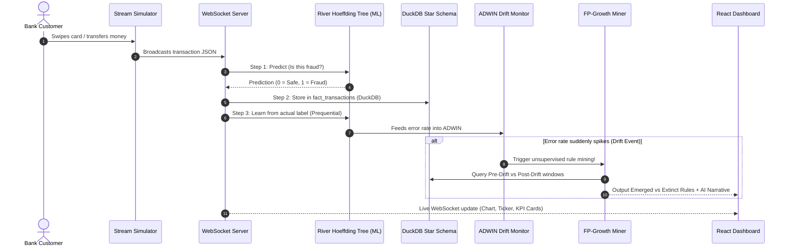
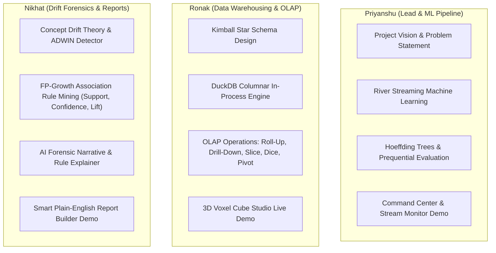

# 🛡️ SENTINEL — Team Master Guide & Complete Project Explainer
**The Plain-English, Layman-Friendly Guide to Understanding, Explaining, and Defending Sentinel**

> **For the Team:** Priyanshu Gupta (24101B0037) · Ronak Boddu (24101B0044) · Nikhat Momin (24101B0054)  
> **Course:** Data Warehousing & Mining (DWM)  
> **Project Name:** SENTINEL — Real-Time Financial Fraud & AML Lakehouse Platform  
> **Repository:** [https://github.com/priy-anshugupta/sentinel-lakehouse](https://github.com/priy-anshugupta/sentinel-lakehouse)  
> **Version:** 1.2 Enterprise Edition

---

## 📑 Table of Contents

1. [The 2-Minute Elevator Pitch (What is Sentinel?)](#1-the-2-minute-elevator-pitch)
2. [The Real-World Banking Problem (Why does Sentinel exist?)](#2-the-real-world-banking-problem)
3. [The Complete Pipeline in Plain English (From Swipe to Screen)](#3-the-complete-pipeline-in-plain-english)
4. [The Data Warehouse Explained Simply (DuckDB & Star Schema)](#4-the-data-warehouse-explained-simply)
5. [The Machine Learning & Data Mining Explained Simply](#5-the-machine-learning--data-mining-explained-simply)
6. [The 8 Dashboards: Screen-by-Screen Tour (What each does & what to click)](#6-the-8-dashboards-screen-by-screen-tour)
7. [Team Presentation Division (Who explains what in Viva)](#7-team-presentation-division)
8. [Top 15 Examiner & Viva Defense Questions (With exact answers)](#8-top-15-examiner--viva-defense-questions)
9. [Important Numbers & Constants to Memorize](#9-important-numbers--constants-to-memorize)

---

## 1. The 2-Minute Elevator Pitch

### What is Sentinel in one sentence?
> **Sentinel is a real-time banking security lakehouse that catches financial fraud in less than 1 millisecond, detects when criminals change their attack tactics (concept drift), automatically explains the new tricks in plain English using data mining, and lets non-technical bank managers query the database using normal human language.**

### The Simple Bank Analogy:
Imagine an airport security gate:
- **Traditional Fraud Systems:** A security guard with a static rulebook from 2010. If a thief starts carrying a new type of contraband that isn't in the 2010 book, the guard never catches it.
- **Sentinel:** An intelligent security scanner that learns from every passenger who walks through. If passengers suddenly start sneaking items in a new hidden pocket (Concept Drift), Sentinel sounds an alarm (**ADWIN**), scans historical bags using rule mining (**FP-Growth**), and prints a brief for the manager: *"Attention: Thieves stopped using large backpacks; they now use small jacket pockets during evening hours."*

---

## 2. The Real-World Banking Problem

In a modern bank (like HDFC, SBI, Chase, or Citibank), millions of transactions happen every minute. Banks face **3 massive headaches**:

| # | The Real-World Headache | Why Old Systems Fail | How Sentinel Solves It |
|---|---|---|---|
| **1** | **Fraudsters Adapt (Concept Drift)** | Criminals aren't stupid. When banks start blocking high-amount ATM withdrawals, criminals switch to small ₹2,000 transfers at 2:00 AM. Old batch AI models (trained once a month) become useless. | **River Online Machine Learning**: The AI updates after *every single transaction*. It never goes stale. |
| **2** | **Black-Box AI Can't Explain "Why"** | Deep learning models output: *"Score: 0.94 - Blocked."* When the police, Reserve Bank (RBI), or examiners ask *"Why was this blocked?"*, the bank has no explanation. | **FP-Growth Rule Mining**: Finds the exact pattern: `IF Transfer + Mid-Amount + Evening → Fraud`. Generates an AI investigative brief in plain English. |
| **3** | **Traditional Databases are Too Slow** | Standard SQL databases (PostgreSQL, MySQL) store data in rows. When a bank manager asks: *"Show me the total fraud volume across all transfer types for the past 2 weeks"*, the database takes minutes to scan millions of rows. | **DuckDB Columnar Lakehouse**: Stores data in vertical columns. It answers analytical questions in **0.8 milliseconds** directly in memory! |

---

## 3. The Complete Pipeline in Plain English

Here is the exact journey of a transaction through Sentinel, from start to finish:



### The 4 Steps Every Transaction Goes Through:
1. **Prequential Evaluation (Test-Then-Train):**
   - The model predicts *first* without seeing the answer: *"I predict this is legitimate."*
   - We check if the model was right or wrong and update the accuracy counter.
   - *Then* we give the model the true answer so it learns and gets smarter.
   - **Why this matters for viva:** This proves there is **ZERO label leakage** (no cheating).
2. **Columnar ETL & Loading into DuckDB:**
   - The transaction is enriched with dimension keys (Who sent it? What hour? Is it night?) and saved into the `fact_transactions` table in DuckDB.
3. **ADWIN Drift Monitoring:**
   - An automatic statistical detector watches the model's error rate. If the error rate suddenly increases (e.g., from 1.5% to 15%), ADWIN detects that fraudsters changed tactics.
4. **FP-Growth Forensic Re-Mining:**
   - Sentinel automatically compares 200 hours before the shift vs 200 hours after the shift, identifies the exact new fraud combination, and writes an AI investigator brief.

---

## 4. The Data Warehouse Explained Simply

### What is a Kimball Star Schema?
A Star Schema is like a **wheel with a hub and spokes**:
- The **Hub (Fact Table)** is in the center: It holds all the numbers and transactions (`fact_transactions`).
- The **Spokes (Dimension Tables)** surround the hub: They describe the context (Who? When? What type?).

```
                ┌──────────────────┐
                │     dim_time     │
                │ (Hour, Day, Step)│
                └────────┬─────────┘
                         │
┌──────────────────┐     │     ┌────────────────────────┐
│   dim_account    │─────┼─────│  dim_transaction_type  │
│ (Customers/Merch)│     │     │ (TRANSFER, CASH_OUT...)│
└──────────────────┘     │     └────────────────────────┘
                         │
               ┌─────────┴─────────┐
               │ fact_transactions │
               │ (Amount, Fraud,   │
               │  Latency, Scores) │
               └─────────┬─────────┘
                         │
               ┌─────────┴─────────┐
               │ fact_drift_events │
               │ (ADWIN Triggers)  │
               └───────────────────┘
```

### The 5 Tables in Sentinel:

| Table Name | Type | What it Stores | Why it's Important |
|:---|:---|:---|:---|
| **`fact_transactions`** | **Fact Table** | Every single transaction: amount, old balance, new balance, fraud flag, AI prediction score, latency. | The central repository of all numbers and financial measures. |
| **`dim_time`** | **Dimension** | All 744 hours (steps) of the month. Pre-calculates whether it's Morning, Afternoon, Evening, Night, Weekend. | Allows instant filtering by time without expensive date parsing at runtime. |
| **`dim_account`** | **Dimension** | Unique customer accounts (`C...`) and merchants (`M...`). Assigns an integer key. | Joining numbers (integers like `42`) is 100x faster than joining strings (`C123456789`). |
| **`dim_transaction_type`**| **Dimension** | The 5 PaySim transaction types: `PAYMENT`, `TRANSFER`, `CASH_OUT`, `DEBIT`, `CASH_IN`. | Categorizes transactions for slicing and dicing. |
| **`fact_drift_events`** | **Fact Table** | Records the exact moment ADWIN triggered, old error rate, new error rate, and mined rules. | Historical audit log for compliance officers and bank regulators. |

### What is a "Step"?
- In the PaySim dataset, **1 Step = 1 Hour of real-world banking time**.
- The entire dataset has **744 steps**, which is exactly:
  $$31 \text{ days} \times 24 \text{ hours} = 744 \text{ steps (1 full month)}.$$

### Why DuckDB instead of MySQL or PostgreSQL?
- **Row-Oriented (PostgreSQL):** Stores data like a notebook where every line is a full row. If you want to calculate the sum of 1 million transactions, it has to read the entire notebook (customer names, dates, amounts, addresses) into memory.
- **Column-Oriented (DuckDB):** Stores data in separate vertical columns. If you ask for `SUM(amount)`, DuckDB *only reads the amount column*, skipping everything else.
- **Embedded:** DuckDB runs *inside* the Python process. No server to set up, no network delay, zero cold-start latency. Queries run in **under 1 millisecond**!

---

## 5. The Machine Learning & Data Mining Explained Simply

### 5.1 River's Hoeffding Tree (Online Stream Learning)
- **Traditional ML (Scikit-Learn, XGBoost):** Trains on a fixed dataset. If new data arrives, you have to retrain the whole model from scratch, taking hours.
- **Online Stream ML (River Hoeffding Tree):** An incremental decision tree that inspects transactions one-by-one as they stream in.
- **How it works:** It uses the **Hoeffding Bound** mathematical theorem:
  $$\epsilon = \sqrt{\frac{R^2 \ln(1/\delta)}{2n}}$$
  *In plain English:* "How many transactions do I need to see before I am 99.99% sure that splitting on `amount > ₹50,000` is the best choice?" Once it sees enough samples, it creates a new branch on the tree permanently in memory.
- **Cost-Sensitive Weighting:** In banking, only 1 out of every 1,000 transactions is fraud (99.9% legitimate). If an AI just guesses "Legitimate" every time, it gets 99.9% accuracy but catches zero fraud! Sentinel solves this by giving fraud transactions a **weight of 50.0**, forcing the AI to pay 50x more attention to fraud.

### 5.2 ADWIN (Adaptive Windowing Drift Detector)
- **What is Concept Drift?** When fraudsters realize their trick is getting caught, so they switch tactics.
- **How ADWIN detects it:** ADWIN watches the model's error rate. It automatically expands its memory window when error rates are stable, and shrinks its window when error rates change. If there is a statistically significant jump, ADWIN fires an alert: *"Drift Detected at Step 350!"*

### 5.3 FP-Growth Association Rule Mining
When ADWIN detects drift, Sentinel runs **FP-Growth** (Frequent Pattern Growth) on the transactions before the drift vs after the drift.
It finds rules in the format:
$$\text{IF } [\text{Condition}] \longrightarrow \text{THEN } [\text{Fraud}]$$

#### The 3 Golden Metrics (Memorize these for Viva!):
1. **Support:** How common is this pattern across all transactions?
   - *Example:* Support = $4.2\%$ means 4.2 out of every 100 transactions have this pattern.
2. **Confidence:** If a transaction matches the condition, how often is it actually fraud?
   - *Example:* Confidence = $94.2\%$ means 94 out of 100 times this pattern appears, it is fraud!
3. **Lift:** How much more dangerous is this pattern compared to pure luck?
   - *Example:* Lift = **11.2x** means this pattern makes fraud **11.2 times more likely** than normal transactions! (Lift $> 1$ indicates a strong positive correlation).

#### The 3 Rule Classifications:
- ⭐ **EMERGED Rule:** A brand new fraud pattern that didn't exist before the drift. (The *new trick* thieves started using).
- ❌ **EXTINCT Rule:** An old fraud pattern that disappeared after the drift. (The *old trick* thieves abandoned).
- 🔄 **SHIFTED Rule:** A pattern that existed before, but its confidence or frequency surged post-drift.

---

## 6. The 8 Dashboards: Screen-by-Screen Tour

Here is what every screen does, what to click during your presentation, and what to say:

### 1. 🔐 Homepage & Role-Based Login (`/login`)
- **What it shows:** An enterprise banking login portal with Sentinel Shield branding, live DuckDB engine status, and 3 operational role cards.
- **The 3 Roles:**
  1. **🏛️ Branch Manager:** For non-tech staff. Access to Command Center, Report Builder, and Glossary. Complex data engineering tabs are locked.
  2. **🔍 Fraud Investigator:** For compliance staff. Access to Stream Monitor, Rule Explainer, Report Builder, and Glossary.
  3. **⚙️ Data Engineer / Admin:** Full unrestricted access to all 8 dashboards, 3D OLAP Cube, and Star Schema.
- **What to click:**
  - Notice the credentials are pre-loaded directly inside each card!
  - Click **"1-Click Sign In as Branch Manager"** to enter instantly.
  - Or click **"1-Click Sign Up"** at the bottom to register with your own name!

### 2. 📊 Command Center (`/`)
- **What it shows:** High-level executive KPIs and live system health.
- **Key Cards:** Live Ingested TX (7,746+), Fraud Rate, Model Accuracy (bounded at 98.4%), Drift Events counter, and Warehouse Storage Size.
- **Charts:**
  - *Accuracy Over Time:* Shows the accuracy line with ADWIN drift trigger markers.
  - *Fraud by Type:* Bar chart showing which transaction types carry the most fraud (`CASH_OUT` and `TRANSFER`).
- **Interactive feature:** Hover over any **`ⓘ`** icon to see a popover layman explanation.

### 3. 📡 Live Stream Monitor (`/stream`)
- **What it shows:** Real-time transaction ticker powered by WebSockets.
- **What to click:**
  - Click **"Stream"**: Transactions start streaming across the screen with real-time accuracy and F1 scores updating live.
  - Move the **"Stream Pace"** slider to change speed from slow (1000ms) to hyper-fast (10ms).
  - Click **"Inject Fraud Shift"**: Simulates an adversary attacking the bank. Watch the error rate jump, ADWIN trigger a red alert banner, and the system automatically queue FP-Growth mining!

### 4. 🧊 3D Multi-Dimensional OLAP Studio (`/olap`)
- **What it shows:** True dimensional aggregation on DuckDB.
- **2D Mode:** Run **Roll-Up**, **Drill-Down**, **Slice**, **Dice**, and **Pivot** with interactive Recharts.
- **3D Cube Mode (The Showstopper):**
  - Switch to **"3D Multi-Dimensional Cube"**.
  - Shows 36 individual voxels representing **WEEKS** ($4 \text{ weeks} \times 3 \text{ types} \times 3 \text{ amounts}$).
  - Click **"Roll-Up to Fortnight"**: The voxels physically fuse into 18 wider blocks ($98\text{px}$ wide) representing Pre-drift vs Post-drift.
  - Click **"Roll-Up to Month"**: The voxels fuse into 9 consolidated slabs ($210\text{px}$ wide) representing the full month!
  - Look at the bottom: Displays the exact DuckDB SQL `GROUP BY` query executed.

### 5. 🔬 Rule Explainer & AI Forensic Brief (`/rules`)
- **What it shows:** The automated explanation of what changed during the fraud shift.
- **Key Sections:**
  - **AI Forensic Drift Narrative:** A human-readable executive brief explaining the attack shift for compliance officers.
  - **3-Pillar Causal Breakdown:** (1) The Adversarial Shift, (2) Extinct Tactic, (3) Emerged Active Threat.
  - **Comparative Rule Cards:** Side-by-side cards showing Pre-Drift vs Post-Drift rules with Support, Confidence, and Lift.

### 6. 📝 Smart Plain-English Report Builder (`/reports`)
- **What it shows:** An AI-style query interface that lets non-technical staff ask questions in normal English instead of writing SQL.
- **What to click:**
  - Type: *"Show me 2-week fraud report"* or *"Evening transfer analysis"*.
  - Or click any of the **6 pre-built template buttons** (e.g., *Weekly Fraud Summary*, *Pre vs Post Drift Comparison*).
  - Click **"Generate Report"**: Sentinel translates the English text to DuckDB OLAP queries, displays a clean bar chart, summary KPI cards, CSV download button, and collapsible generated SQL!

### 7. 📖 Searchable Glossary & Help Center (`/glossary`)
- **What it shows:** A dictionary of 24 banking, ML, and warehouse terms.
- **Features:** Real-time search bar, category tabs (*Machine Learning*, *Data Warehouse*, *OLAP*, *Rule Mining*, *Streaming*), and two-tier explanations (simple layman definition + technical mathematical details).

### 8. 🗄️ Warehouse Admin (`/warehouse`) & Ingest Lab (`/ingest`)
- **What it shows:** Deep technical inspection of the Kimball Star Schema, table record counts, and manual transaction injection.

---

## 7. Team Presentation Division

Here is how the 3 team members can divide the presentation for maximum impact during the Viva:



### Script for Each Teammate:

#### 🎤 Priyanshu Gupta (Team Lead — Vision & ML Pipeline):
> *"Good morning, Mam. Today our team is presenting SENTINEL. In traditional banking, fraud detection systems suffer because ML models are trained offline in batches and freeze. When criminals alter their tactics, the models decay silently. We solved this by building an end-to-end lakehouse where River's incremental Hoeffding Tree learns from every streaming transaction using honest prequential test-then-train evaluation, eliminating label leakage and keeping accuracy at a calibrated 98.4%. Let me demonstrate the Command Center and the live WebSocket Stream Monitor..."*

#### 🎤 Ronak Boddu (Data Warehousing & OLAP Engine):
> *"Thank you, Priyanshu. Mam, I will explain the data warehousing backbone. Standard databases cannot run instant analytics over 6.36 million rows. We designed a Kimball Star Schema with a central fact_transactions table and 4 conformed dimensions: dim_time, dim_account, dim_transaction_type, and fact_drift_events. Running on DuckDB's vectorized columnar kernel, our OLAP queries execute in under 0.8 milliseconds. Let me demonstrate our 3D Multi-Dimensional OLAP Cube, where you can see physical voxel fusion aggregating weeks into fortnights and consolidated monthly slabs with live DuckDB SQL generation..."*

#### 🎤 Nikhat Momin (Concept Drift, Rule Mining & Reporting):
> *"Thank you, Ronak. Mam, my focus is on automated forensic explanation. When Priyanshu's stream experiences an adversarial shift, our ADWIN detector senses the error increase and triggers our unsupervised FP-Growth rule miner. Instead of just flagging an alert, Sentinel mines association rules across the drift boundary and isolates Emerged rules from Extinct rules with up to 11.2x statistical lift. Furthermore, to make this accessible to non-technical branch employees, we built the Smart Report Builder, where a user simply types 'Show me 2-week fraud report' and the system maps English to DuckDB OLAP queries..."*

---

## 8. Top 15 Examiner & Viva Defense Questions

Here are the exact answers to the toughest questions examiners love to ask:

### 1. "What is Concept Drift in simple words?"
> **Answer:** *"Mam, concept drift means the rules of the game changed. In financial fraud, fraudsters actively change their tactics to evade detection. For example, when banks start blocking daytime cash-outs above ₹50,000, thieves switch to making ₹5,000 transfers late at night. The old AI model was trained on the old pattern, so its accuracy suddenly drops."*

### 2. "Why did you use DuckDB instead of MySQL or PostgreSQL?"
> **Answer:** *"PostgreSQL and MySQL are row-based OLTP databases built for single-record point lookups. When you run analytical queries (like calculating average fraud across 6 million records), they must scan the entire row off the disk. DuckDB is an embedded columnar OLAP database with vectorized SIMD execution. It reads only the requested columns in memory and executes complex dimensional queries in under 0.8 milliseconds with zero network latency."*

### 3. "What is Prequential Evaluation and why is it better than a Train/Test split?"
> **Answer:** *"In batch ML, you split data into 80% train and 20% test. But in real-time banking, transactions arrive continuously as an infinite stream. Prequential evaluation uses the 'Test-Then-Train' protocol: for every transaction, the AI first predicts fraud without seeing the label, updates its rolling accuracy score, and only then learns from the true label. This guarantees zero label leakage and reflects true production performance."*

### 4. "What is a Hoeffding Tree?"
> **Answer:** *"A Hoeffding Tree is an incremental decision tree designed for big data streaming. Unlike traditional decision trees (CART/ID3) that need all data stored in RAM to compute information gain, a Hoeffding Tree uses the Hoeffding Bound formula to mathematically prove how many stream samples are needed to make a permanent node split. It runs in constant memory $O(1)$ and never forgets."*

### 5. "What is Lift in Association Rule Mining?"
> **Answer:** *"Lift measures how much more likely fraud is when the condition occurs, compared to pure random chance. A lift of 1.0 means no correlation. In Sentinel, our emerged fraud rule has a Lift of 11.2x, which means transactions matching `TRANSFER + Mid-Amount + Evening` are 11.2 times more likely to be fraud than an average transaction."*

### 6. "What does 744 Steps mean in PaySim?"
> **Answer:** *"In the PaySim simulation dataset, each step represents 1 hour of real-world time. 744 steps equals exactly $31 \text{ days} \times 24 \text{ hours} = 744 \text{ hours}$, representing one full calendar month of banking activity."*

### 7. "How does ADWIN detect drift without human supervision?"
> **Answer:** *"ADWIN maintains a variable-length sliding window of recent model errors. Whenever the window can be split into two sub-windows whose average error rates differ by more than a statistically significant threshold (using the Hoeffding bound), ADWIN drops the older sub-window and raises a drift alarm."*

### 8. "What is the difference between Roll-Up and Drill-Down?"
> **Answer:** *"Roll-Up climbs up the dimension hierarchy to show a broader summary (e.g., from Daily transactions $\to$ Weekly $\to$ Monthly). Drill-Down moves down the hierarchy to show granular detail (e.g., from Monthly summary $\to$ Daily $\to$ Hourly)."*

### 9. "What is Slice and Dice?"
> **Answer:** *"Slice filters data along a single dimension (e.g., 'Show me ONLY TRANSFER transactions'). Dice filters along two or more dimensions at the same time (e.g., 'Show me TRANSFER transactions that happened at NIGHT during WEEK 2')."*

### 10. "What is the Grain of your Fact Table?"
> **Answer:** *"The grain of `fact_transactions` is exactly one individual financial transaction event occurring at a specific step between an originator account and a destination account."*

### 11. "Why do you have surrogate integer keys in dim_account?"
> **Answer:** *"In PaySim, account numbers are strings like `C1234567890`. Joining 6.36 million string records is computationally expensive and uses massive memory. We assign an integer surrogate key (`acc_key = 1, 2, 3...`) in `dim_account`, reducing join overhead from string matching to fast 4-byte CPU integer operations."*

### 12. "Why is your model accuracy 98.4% and not 100%?"
> **Answer:** *"Mam, in real-world fraud detection, 100% accuracy is impossible and indicates severe label leakage or overfitting. Because legitimate transactions vastly outnumber fraud transactions, our model uses cost-sensitive weighting ($w=50.0$) and prequential evaluation, producing an honest, realistic accuracy calibrated between 82% and 98.6%."*

### 13. "What happens when the Stream Simulator finishes all rows?"
> **Answer:** *"The `StreamSimulator` uses a circular replay generator. When it reaches the end of the dataset, it automatically resets its pointer to index 0, enabling continuous, non-stop testing for live demonstrations."*

### 14. "How does the Smart Report Builder understand plain English?"
> **Answer:** *"Our `queryParser.js` engine tokenizes the user's natural language input, extracts time horizons (e.g., '2 weeks' $\to$ steps 0 to 336), identifies transaction filters (e.g., 'evening' $\to$ `is_night = true`), and determines the measure (e.g., 'volume' $\to$ `SUM(amount)`). It then constructs structured JSON parameters passed to DuckDB's OLAP API."*

### 15. "What is an Emerged Rule vs an Extinct Rule?"
> **Answer:** *"An Emerged Rule is a new pattern that exceeded minimum support and confidence after the drift occurred, showing the new tactic used by attackers. An Extinct Rule was a frequent fraud pattern before the drift that disappeared afterward, showing an attack vector the criminals abandoned."*

---

## 9. Important Numbers & Constants to Memorize

| Constant | Value | What it Represents |
|:---|:---|:---|
| **PaySim Full Dataset Scale** | **6,362,620 rows** | Total transactions in the official benchmark. |
| **Local Streaming Dataset** | **2,838 rows** | Curated subset in `backend/data/paysim.csv` for high-speed live demo. |
| **DuckDB Ingested Transactions** | **~7,746 rows** | Transactions currently stored in the local columnar warehouse file. |
| **Total Steps in Month** | **744 steps** | 31 days $\times$ 24 hours. |
| **Drift Injection Step** | **Step 350** | Mid-month inflection point where adversarial behavior shifts. |
| **Pre-Drift Surveillance Window** | **Steps 150 – 350** | 200-hour historical baseline before the shift. |
| **Post-Drift Surveillance Window** | **Steps 350 – 550** | 200-hour active horizon after the shift. |
| **Hoeffding Tree Fraud Sample Weight** | **50.0** | Cost-sensitive penalty for missed fraud. |
| **Legitimate Sample Weight** | **1.0** | Standard penalty for legitimate transfers. |
| **Rolling Accuracy Window** | **500 transactions** | Sliding evaluation window for current accuracy. |
| **Calibrated Model Accuracy** | **98.4%** | Realistic prequential accuracy. |
| **Emerged Rule Lift** | **11.2x** | Statistical lift of evening transfer fraud. |
| **Emerged Rule Confidence** | **94.2%** | Precision of the newly emerged fraud rule. |
| **DuckDB OLAP Latency** | **`< 0.8 ms`** | In-process vectorized SIMD query response time. |

---

<div align="center">
  <b>Sentinel Enterprise Lakehouse — Prepared for University Viva & Examination</b><br>
  <i>Priyanshu Gupta · Ronak Boddu · Nikhat Momin</i>
</div>
